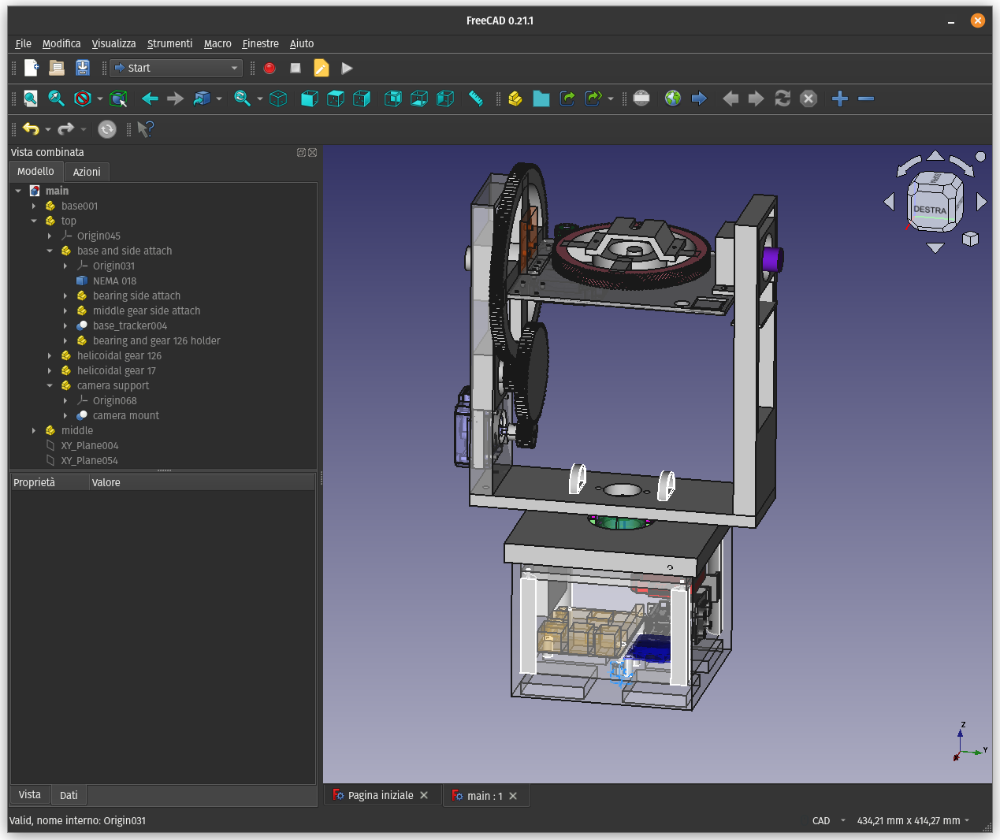

# CAD Files
This folder contains the cad files.

The files were developed using the FreeCAD software; the main file, containing all the parts, is `main.FCStd`. 

The `std` folder contains all the `.std` files exported from FreeCAD, and organized in subfolders according to their placement and purpose. 